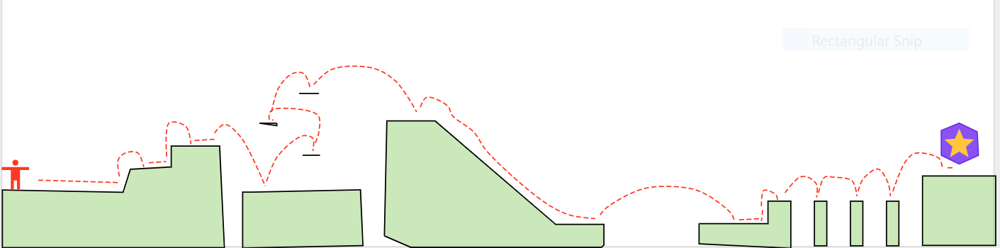
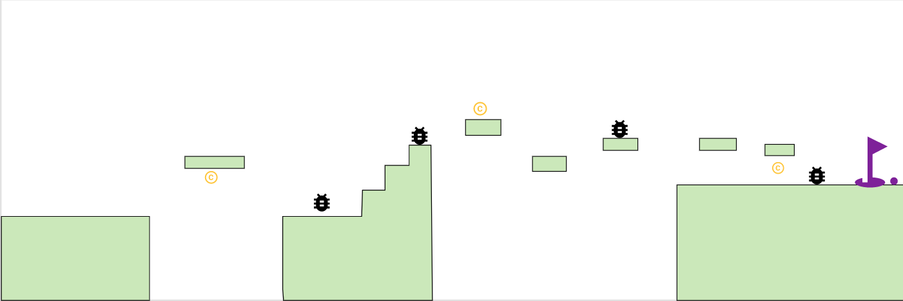
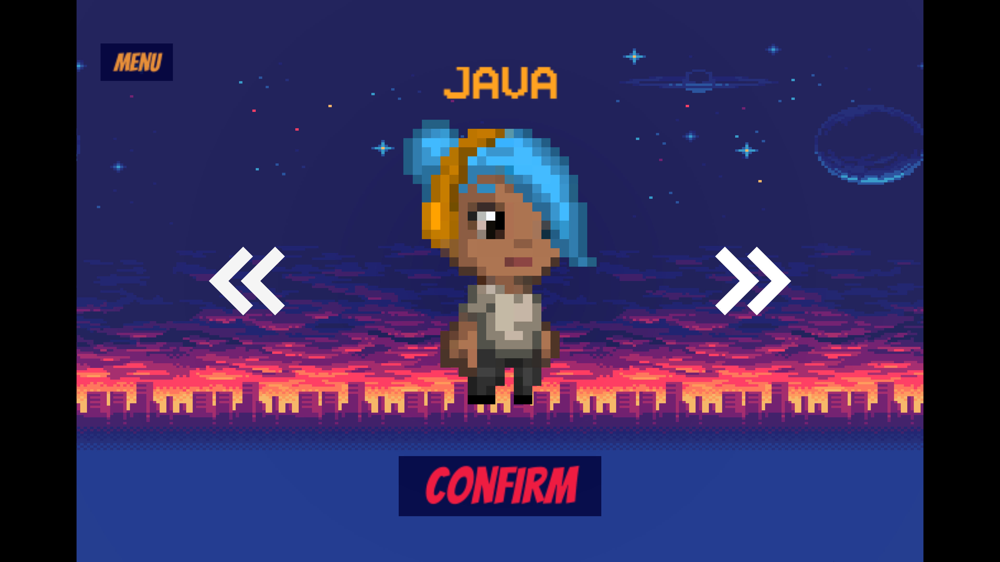
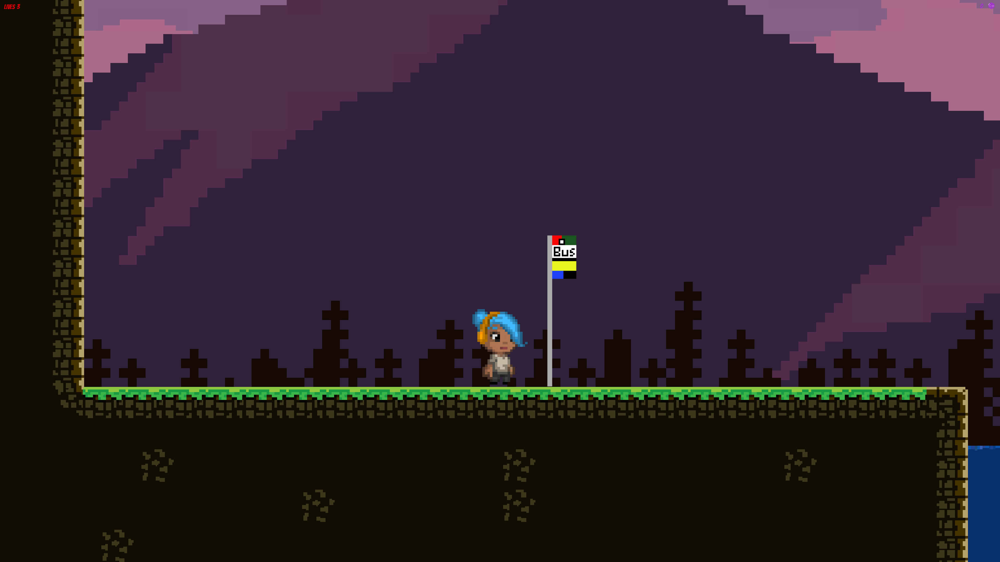
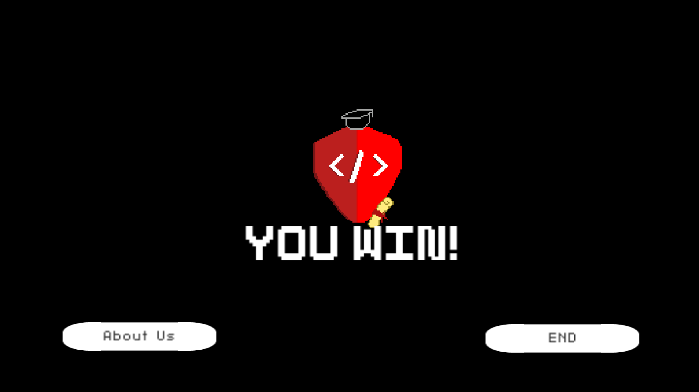
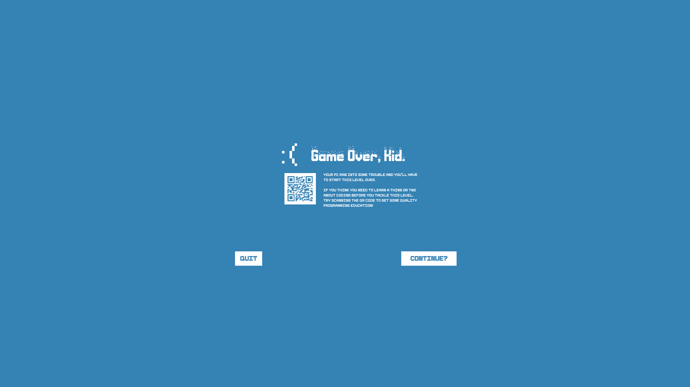

# Kode Kid


## Unity Application
Side scrolling 2D game built in Unity. A "student" is trying to make it to class, but he must face many obstacles and overcome puzzles and platforming to reach his goal.

---
## Authors

[Allyson Reyes](https://github.com/areyes986)  
[Brandon Johnson](https://github.com/SplinterCel3000)  
[Harrison Cogswell](https://github.com/HCoggers)  
[Jin Woo Kim](https://github.com/Jinwoov)  


---

## Tools Used
[Unity](https://unity.com/)  
[Piskel](https://www.piskelapp.com/)  
[Beepbox](https://beepbox.co/)   
[Microsoft Visual Studio Community](https://visualstudio.microsoft.com/vs/community/)  
[Unity Dashboard](https://developer.cloud.unity3d.com/)  

---

## Getting Started

Clone this repository to your local machine.

```
$ git clone https://github.com/TeamCubone/Kode-Kid.git
```

Once pulled down to your machine, open the project in the Unity and under `File` -> `Build and Run`

This will run the application successfully and start the application. 

For control,
`Left` & `right` or `A` & `D` to move, and space bar or `W` to jump. Escape to pause or quit the application.

---
## Initial Wireframe


*Tutorial wireframe*


*Level 1 wireframe*


---

## Usage

*Start Screen*


*Character selection*


*Ingame Screen*


*Winning Screen*


*Game Over Screen*


---
# Change Logs

**1.0 Version Released**
- Added background sound to the game - 05/20/2020
- Created a new levels and cleaned fade in and out to different scenes. - 05/20/2020
- About us page is added and added multiple sprites for personal touch - 05/20/2020
- implemented multiple screens and transition to multiple levels. - 05/19/2020
- Added death to the character upon collision to the hazards. - 05/19/2020
- Added death count, coin count, and round count to the game. - 05/19/2020
- Created game over screen and added character select to the game. - 05/19/2020
- Implemented parallax background to the game and pause interface in the game. - 05/19/2020
- Added main menu to the game and enemy to appear. - 05/18/2020
- Implemented base platforms and tiles and character sprites to render with animation. -  05/18/2020