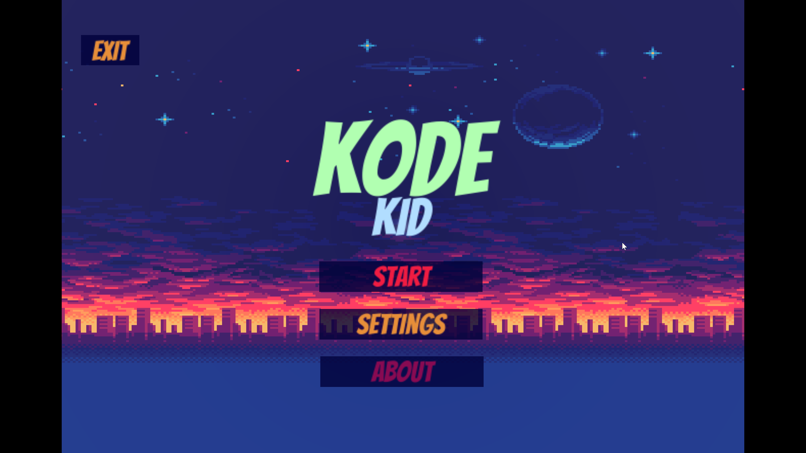
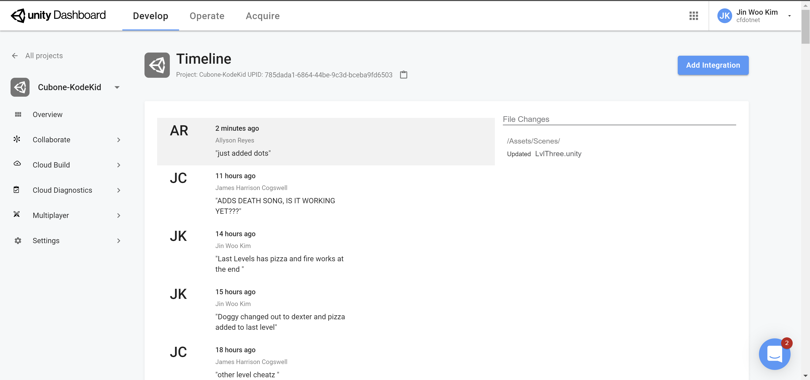

# Kode Kid

---
### Table Of Contents
1. [Overview](#overview)
2. [Deployed Site](#Deployed-Link)
3. [Authors](#Authors)
4. [Tools Used](#Tools-Used)
5. [Getting Started](#Getting-Started)
6. [Initial Wireframe](#Initial-wireframe)
7. [Visual](#Visual)
8. [Change Logs](#change-logs)
9. [Resources](#Resources)


## Overview
Side scrolling 2D game built in Unity. A "student" is trying to make it to class, but he must face many obstacles and overcome puzzles and platforming to reach his goal.

---
## Deployed Link
[Deployed Link](https://hcoggers.itch.io/kode-kid)

---
## Authors

[Allyson Reyes](https://github.com/areyes986)  
[Brandon Johnson](https://github.com/SplinterCel3000)  
[Harrison Cogswell](https://github.com/HCoggers)  
[Jin Woo Kim](https://github.com/Jinwoov)  

---

## Tools Used
[Unity](https://unity.com/)  
[Piskel](https://www.piskelapp.com/)  
[Beepbox](https://beepbox.co/)   
[Microsoft Visual Studio Community](https://visualstudio.microsoft.com/vs/community/)  
[Unity Dashboard](https://developer.cloud.unity3d.com/)  

---

## Getting Started

Clone this repository to your local machine.

```
$ git clone https://github.com/TeamCubone/Kode-Kid.git
```

Option 1. Once pulled down to your machine, open the project in the Unity and under `File` click on `Build and Run`

This will run the application successfully and start the application. 

Option 2 Depending on operating system, for Mac user navigate to `KodeKid.app` to run the application. For window user, navigate to KodeKidWindows and run the program.

For control,
`Left` & `right` or `A` & `D` to move, and `space bar` or `W` to jump. Hit `Escape` to pause or quit the application.

---
## Initial Wireframe


*Tutorial wireframe*


*Level 1 wireframe*


---

## Visual

*Start Screen*


*Character selection*


*Ingame Screen*


*Winning Screen*


*Game Over Screen*


*Unity Source Control*


---
## Change Logs

**1.0 Version Released**
- Added background sound to the game - 05/20/2020
- Created a new levels and cleaned fade in and out to different scenes. - 05/20/2020
- About us page is added and added multiple sprites for personal touch - 05/20/2020
- implemented multiple screens and transition to multiple levels. - 05/19/2020
- Added death to the character upon collision to the hazards. - 05/19/2020
- Added death count, coin count, and round count to the game. - 05/19/2020
- Created game over screen and added character select to the game. - 05/19/2020
- Implemented parallax background to the game and pause interface in the game. - 05/19/2020
- Added main menu to the game and enemy to appear. - 05/18/2020
- Implemented base platforms and tiles and character sprites to render with animation. -  05/18/2020 

## Resources

[Udemy](https://www.udemy.com/course/unitycourse)  
[Rule Tile](https://github.com/Unity-Technologies/2d-extras)  
[Tiles](https://creativemarket.com/Foxfin/304893-Super-Platformer-Assets)  
[Parallax Background](https://ansimuz.itch.io/mountain-dusk-parallax-background?download)  
[Graduation song](https://www.youtube.com/watch?v=_doAV8bx0xg)  